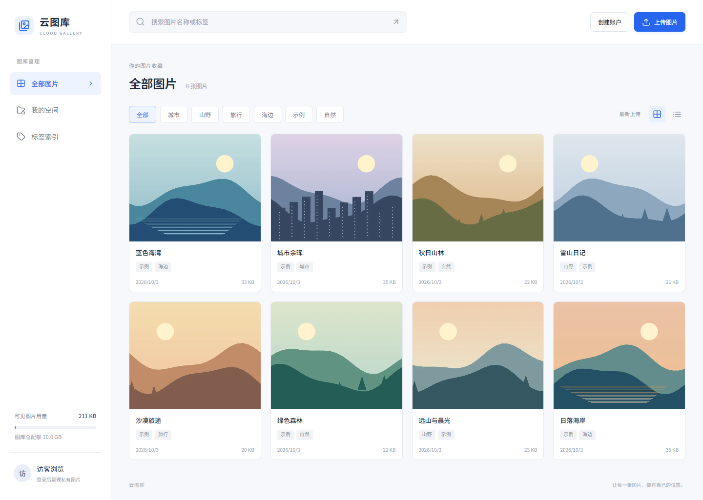

# 云图库 · 第一版（v0.1.1 自检修复版）

独立的 Vue 3 + TypeScript + FastAPI 图片管理项目。已实现真实登录、公开图库、私有空间、图片上传/查看/编辑/删除、缩略图、名称与标签搜索、分页及存储配额。没有接入付费 API。

详细技术栈、数据模型、API 与上传流程见 [项目框架说明](docs/project-framework.md)，本次自检修复见 [自检报告](docs/self-check.md)。

## 界面预览



示例图为项目生成的原创插画。桌面和手机界面均已验证，手机截图见 [mobile.png](docs/screenshots/mobile.png)。

## 启动

需要 Python 3.12+、Node.js 22.12+。在项目目录打开两个终端。

后端（Windows PowerShell）：

```powershell
cd backend
python -m venv .venv
.\.venv\Scripts\python.exe -m pip install -r requirements-lock.txt
Copy-Item .env.example .env
.\.venv\Scripts\python.exe -m app.cli init-db
.\.venv\Scripts\python.exe -m app.cli seed-demo
.\.venv\Scripts\python.exe -m uvicorn app.main:app --host 127.0.0.1 --port 8040 --workers 1 --limit-concurrency 16
```

前端（第二个终端）：

```powershell
cd frontend
npm ci
npm run dev
```

打开 **http://127.0.0.1:5173/**。首次点击“创建账户”设置自己的用户名和密码。没有内置可登录账户；示例图片所属账户已禁用。初始个人空间默认私有；从全部图片页面上传时优先选中私有空间，从空间页面上传时选中当前可上传的空间。

安装依赖后，Windows 也可从项目根目录运行 `scripts/start.ps1` 隐藏启动两个服务，用 `scripts/stop.ps1` 停止本脚本记录的进程。脚本不会停止占用相同端口的其他应用，日志位于 .local/。

Linux/macOS 使用 `python3 -m venv .venv` 和 `.venv/bin/python`，其他命令相同。配置模板中的路径相对于 backend 工作目录。开发默认 SQLite，生产使用独立 PostgreSQL 数据库。

清理示例图：`python -m app.cli clear-demo`，仅删除示例账户的图片。再次运行 seed-demo 不会重复导入。生产账户通过服务器终端的 `python -m app.cli create-user 用户名` 创建，密码隐藏输入。生产关闭网页首次创建账户入口，不提供公开注册。

## 结构

```text
cloud-gallery/
├── frontend/
│   ├── src/
│   │   ├── pages/            # 全部图片、我的空间、标签管理
│   │   ├── components/       # 登录、上传、图片详情弹窗
│   │   ├── api.ts            # 同源 API / CSRF
│   │   └── session.ts        # 登录和空间状态
│   └── vite.config.ts
├── backend/
│   ├── app/
│   │   ├── core/             # 配置、数据库、认证
│   │   ├── modules/          # auth / spaces / pictures
│   │   ├── models.py         # SQLAlchemy 数据模型
│   │   ├── storage.py        # 校验、图片处理、受保护文件存储
│   │   ├── cli.py            # 初始化和账户管理
│   │   └── demo.py           # 可选原创示例插画
│   └── tests/                # 权限和上传集成测试
├── deploy/                   # PostgreSQL、systemd、OpenResty 模板
└── docs/architecture.md
```

## 权限与图片处理

- 未登录只能浏览公开空间。私有图片的列表、标签、原图、缩略图均在 API 中检查身份，猜到图片地址也不能绕过权限。
- 账户只能管理自己的空间和图片。公开空间中的图片仍只能由上传者编辑/删除。
- 登录使用 scrypt 密码哈希与数据库会话；浏览器 cookie 为 HttpOnly、SameSite=Strict，生产必须 Secure。写请求还检查 CSRF 和 Origin。
- 单张最多 10 MiB / 1200 万像素，仅 JPEG、PNG、WebP。服务端按实际文件内容校验并重新编码，移除 EXIF 等元数据；动画仅保留第一帧。界面中的原图为处理后的全尺寸图片，不保证与上传文件逐字节相同。
- 自动生成最大 720 像素的 WebP 缩略图，一次处理一张图。全尺寸图与缩略图合计计入 10 GiB 全站配额，配额在数据库内原子扣减。
- 页面“当前可见图片”用量只统计当前账户可访问的图片，不泄露其他账户的私有用量；该数值不是全站剩余容量。

## 验证

```powershell
cd backend
.\.venv\Scripts\python.exe -m pip install -r requirements-dev.txt
.\.venv\Scripts\python.exe -m pytest
```

前端：`npm run build`（含 TypeScript 类型检查）。浏览器验证记录见 [verification.md](docs/verification.md)。

测试只创建临时 SQLite 数据库，不读取开发或生产数据库。PostgreSQL 连接和表定义已准备；部署前还需在独立 PostgreSQL 测试库验证。当前 init-db 只负责新库建表，不是升级迁移工具，后续变更已有表需增加 Alembic 迁移。

## 部署与边界

[部署说明](deploy/README.md) 提供子路径 `/gallery/` 的参考配置、内存限制和备份方法。当前版本是本地可运行基础版，部署模板仍需在目标服务器验证。

第一版使用服务器磁盘，不需要 COS、Redis、消息队列、短信、AI 或 pgvector。团队协作、批量上传、AI 标签、图像相似检索、分享链接和对象存储留到后续版本。标签页展示可见标签及数量，修改标签通过图片详情完成。

数据库和文件落盘不是跨系统事务；进程崩溃或磁盘故障可能遗留文件，需要离线对账。正式部署要同时备份数据库和图片目录，并在真实负载下检查容量与内存。
