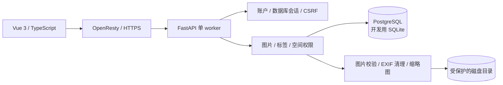
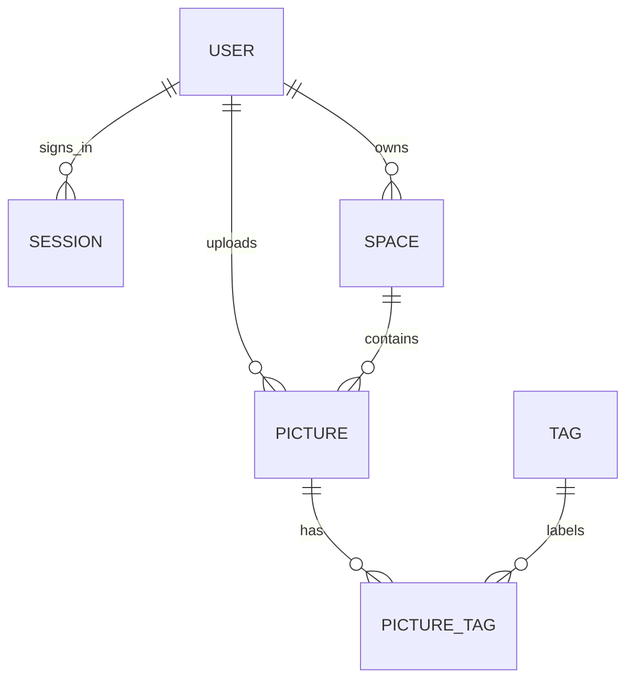

# 项目框架

浏览器仅使用同源 /api 接口。本地由 Vite 代理到 8040；子路径部署由 OpenResty 把 /gallery/api 转发到 FastAPI 的 /api。Vue Router 与 API 地址均从 Vite BASE_URL 获取前缀。

## 数据关系

独立表名均以 gallery_ 开头；图片数据不放进数据库，数据库保存 UUID、标题、标签、尺寸、大小和所属空间。一个 storage 行记录全站用量。公共图库没有空间所有者，其他空间属于某个账户。

权限决定于空间公开性和当前账户；写入还要求图片或空间归自己。私有文件目录不挂静态服务，每次请求由 API 检查权限后输出文件。

## 后续扩展

1. 新字段与表结构变更引入 Alembic，升级前备份和在测试库演练。
2. 对象存储替换 storage.py 的路径与文件操作，使用私有桶和短时签名地址。
3. 团队空间增加 membership 表及角色，再扩展访问判定。
4. 大规模图片处理放入后台任务，目前不引入队列和 Redis。
5. 图片相似检索另建 embedding 表及向量索引，当前的标题/标签搜索不依赖模型或 pgvector。

