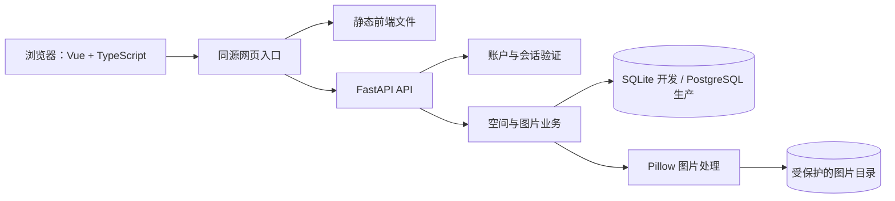
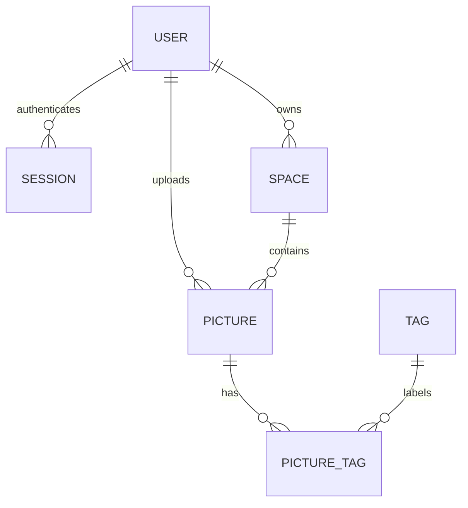

# 云图库项目框架与技术栈（v0.1.1）

这是一套前后端分离、业务模块放在同一个后端进程中的应用。浏览器运行 Vue，FastAPI 提供 HTTP API；数据库保存账户、空间与图片元数据，磁盘保存全尺寸图片和缩略图。当前验收环境是本机 SQLite，生产目标为独立 PostgreSQL 数据库。

## 技术栈与职责

以下版本来自本次实际安装和锁定文件，不代表各工具最新版本。

| 层 | 技术 / 已测试版本 | 在项目中的作用 |
|---|---|---|
| 页面 | Vue 3.5.43 | 单文件组件、Composition API、响应式界面 |
| 前端语言 | TypeScript 5.9.3 | 定义账户、空间、图片、API 返回数据的类型 |
| 路由 | Vue Router 4.6.4 | 全部图片、我的空间、标签索引与查询条件 |
| 构建 | Vite 6.4.3 / vue-tsc 2.2.12 | 开发服务器、API 代理、生产打包、类型检查 |
| 界面 | 自定义 CSS / lucide-vue-next 0.468.0 | 网格、弹窗、手机适配、图标 |
| 状态与请求 | Vue reactive / 浏览器 Fetch | 登录状态、空间列表、CSRF、同源 API 请求 |
| Python | Python 3.12 | 后端语言，本机使用 3.12.14 |
| API | FastAPI 0.142.2 | 路由、依赖注入、表单解析和 OpenAPI 文档 |
| 输入校验 | Pydantic 2.13.5 | 字段类型、长度、标签清理及非法字符限制 |
| HTTP 服务 | Uvicorn 0.54.0 | 运行 FastAPI，本地与生产模板绑定回环地址 |
| 数据访问 | SQLAlchemy 2.0.54 | ORM 模型、查询、事务、关系和数据库连接池 |
| PostgreSQL 驱动 | psycopg 3.3.6 | 生产 PostgreSQL 连接，使用 psycopg 的二进制发行包 |
| 数据库 | SQLite / PostgreSQL | 本地用持久化 SQLite 文件，生产配置要求 PostgreSQL |
| 图片处理 | Pillow 12.3.0 | 解码、方向修正、元数据清理、压缩和 WebP 缩略图 |
| 认证 | scrypt / 数据库会话 / Cookie | 密码哈希、会话撤销、HttpOnly / Secure 属性 |
| 测试 | pytest 9.1.1 / HTTPX 0.28.1 | 后端集成与并发回归测试 |
| 浏览器验证 | Playwright + Chrome | 实际点击、上传、异常请求与手机布局检查 |
| 生产部署模板 | OpenResty / systemd | HTTPS 反向代理、静态文件、进程守护与资源限制 |

前端状态直接集中在 session.ts 中；HTTP 请求集中在 api.ts。Vue Router 负责地址状态，例如 q、tag、space 查询参数。界面通过返回数据渲染，未使用本地数组模拟上传或搜索。

## 整体链路



开发时，同源入口是 Vite 的 5173 端口，它把 /api 转发到 8040。生产模板中，同源入口是 HTTPS 网站：OpenResty 输出前端静态文件，并把 /gallery/api/ 转发到 FastAPI 的 /api/。子路径由 VITE_BASE_PATH 配置，前端路由、资源和 API 地址共同使用该前缀。

## 文件组织

```text
cloud-gallery/
├── frontend/
│   ├── src/
│   │   ├── App.vue                  # 侧栏、搜索、账户状态和页面容器
│   │   ├── main.ts                  # Vue 与路由入口
│   │   ├── api.ts                   # Fetch、CSRF、统一错误处理
│   │   ├── session.ts               # 身份、空间、配额、刷新顺序控制
│   │   ├── types.ts                 # 前端数据类型
│   │   ├── style.css                # 布局与手机适配
│   │   ├── pages/
│   │   │   ├── GalleryPage.vue      # 筛选、分页、网格与列表
│   │   │   ├── SpacesPage.vue       # 创建与编辑个人空间
│   │   │   └── TagsPage.vue         # 可见标签统计与跳转
│   │   └── components/
│   │       ├── AppDialog.vue        # 原生 dialog 弹窗容器
│   │       ├── AuthDialog.vue       # 初始化与登录
│   │       ├── UploadDialog.vue     # 文件选择和上传
│   │       └── PictureDialog.vue    # 图片查看、编辑与删除
│   ├── vite.config.ts
│   └── package-lock.json
├── backend/
│   ├── app/
│   │   ├── main.py                  # API 入口、中间件、异常与健康检查
│   │   ├── core/
│   │   │   ├── config.py            # 环境配置与启动校验
│   │   │   ├── database.py          # 引擎、会话、建表与账户写入锁
│   │   │   └── security.py          # 密码、会话、CSRF、登录限速
│   │   ├── modules/
│   │   │   ├── auth.py              # 初始化、登录、退出、当前身份
│   │   │   ├── spaces.py            # 空间可见性与管理
│   │   │   └── pictures.py          # 图片、检索、标签与配额接口
│   │   ├── models.py                # 七张关系表
│   │   ├── schemas.py               # 输入校验
│   │   ├── storage.py               # 文件处理和磁盘操作
│   │   ├── cli.py                   # 初始化与创建账户
│   │   └── demo.py                  # 原创示例图生成与清理
│   └── tests/
├── deploy/                          # 环境、systemd、OpenResty 模板
├── scripts/                         # Windows 本地启动与停止
├── docs/
└── .github/workflows/ci.yml          # 仓库使用后可运行的 CI 配置
```

当前按业务拆分路由模块，主要业务逻辑位于 modules 中，公共能力放在 core 和 storage.py。以后业务增多时，可抽取 service 层管理复杂事务；目前目录中没有独立的 service / repository 层。

## 数据库设计

| 表 | 保存什么 | 关系和约束 |
|---|---|---|
| gallery_users | 用户名、密码哈希、禁用状态 | 用户名唯一；示例账户禁止登录 |
| gallery_sessions | 会话令牌哈希、CSRF 值、到期时间 | 指向账户，删除账户时级联删除 |
| gallery_spaces | 名称、所有者、是否公开 | 一个账户拥有多个空间；公共图库的所有者为空 |
| gallery_pictures | UUID、标题、描述、空间、上传者、尺寸、字节数、时间 | 每张图片属于一个空间和一个上传者 |
| gallery_tags | 规范化标签名称 | 名称唯一，共用标签记录 |
| gallery_picture_tags | 图片与标签的对应关系 | 多对多；删除图片时级联删除对应关系 |
| gallery_storage | 全站已使用字节数 | 用于原子预留和回收存储配额 |

图片文件以 UUID 命名，保存在图片目录；数据库中保存元数据和对应的扩展名。全尺寸图与缩略图均计入用量。删除图片后，不再被图片使用的标签不会出现在索引中，标签记录本身暂时保留。



## 一次上传的完整过程

1. 前端读取选择的文件和目标空间。在空间页面打开上传时默认选中当前有上传权限的空间；从全部图片页面上传时优先选个人私有空间。
2. 前端以 multipart/form-data 发送文件、名称、标签和空间 ID，并带上 Cookie 和 CSRF 请求头。
3. 后端确认登录状态和目标空间的上传权限。文件大小按实际读取的字节检查，不依赖文件扩展名。
4. Pillow 检查真实图片格式和像素数，修正 EXIF 方向，清理元数据，然后输出全尺寸图与最大 720 像素的 WebP 缩略图。透明图保存为 PNG，其余全尺寸图保存为 JPEG。
5. 数据库以条件 UPDATE 原子预留总配额，写入文件、图片元数据和标签关联后提交事务。
6. 如果文件写入或提交失败，后端回滚数据库并清理本次生成的文件；正常完成后前端刷新图片、空间和用量。

默认上传上限为 10 MiB / 1200 万像素，全站配额为 10 GiB。界面显示的原图是处理后的全尺寸图；重新编码可能改变文件大小和色彩表现。动画保留第一帧。上述限制可以通过配置调整，正式调整后需重新评估内存与磁盘。

## 检索与界面状态

名称检索和标签检索由数据库执行。q 对标题与标签做包含匹配，tag 对规范化标签做精确匹配；space_id 只查指定空间。查询还会附加当前用户的空间可见性条件。百分号与下划线会按字面字符处理。

分页默认每页 24 张，上限 60 张。删除末页最后一张图片后，前端回到仍然有效的页面。请求顺序编号防止慢请求覆盖新的搜索结果。

登录状态变化时会同步清除旧图片、标签、详情和空间编辑状态。退出后请求失败也不会继续展示旧列表；写接口返回 401 时，前端清除会话状态并打开登录弹窗。

## 权限与认证

- 新建个人空间默认私有；访客只看得到公开空间。
- 私有图片的列表、标签统计、原图与缩略图全部经后端授权。
- 修改空间要求是空间所有者；修改和删除图片要求是上传者。
- 公共图库允许已登录账户上传；其他账户拥有的公开空间可浏览，但不能上传。
- 密码用 scrypt 加盐哈希。会话令牌在数据库中只存 SHA-256 哈希，原令牌保存在 HttpOnly Cookie 中。
- 会话期限为 7 天，退出会删除对应的数据库会话。生产要求 HTTPS Origin 和 Secure Cookie。
- 写请求检查 CSRF 和 Origin。同一来源 IP 五分钟最多 10 次登录或初始化尝试；部署时需核对反向代理的可信 IP 配置。
- 开发可在页面创建首个账户；生产关闭该入口，账户由维护命令隐藏输入密码创建。
- 输入校验错误不会回传提交的密码值。

## API 按职责划分

| 接口 | 作用 |
|---|---|
| GET /api/health | 数据库可用性和开发首次初始化状态 |
| POST /api/auth/setup | 开发环境创建首个账户 |
| POST /api/auth/login | 登录并建立会话 |
| GET /api/auth/me | 当前账户及 CSRF 值 |
| POST /api/auth/logout | 撤销当前会话 |
| GET /api/spaces | 当前可见空间、图片数量和用量 |
| POST /api/spaces | 创建个人空间 |
| PATCH /api/spaces/{id} | 修改名称与公开范围 |
| GET /api/pictures | 按名称、标签、空间检索并分页 |
| POST /api/pictures | 上传并生成缩略图 |
| PATCH /api/pictures/{id} | 修改标题、描述和标签 |
| DELETE /api/pictures/{id} | 删除图片并回收配额 |
| GET /api/pictures/{id}/content | 授权读取全尺寸图或缩略图 |
| GET /api/tags | 可见图片对应的标签与数量 |
| GET /api/storage | 可见图片用量及配置的全站配额、上传限制 |

空间当前支持创建和编辑；图片支持删除。当前没有空间删除、图片移动、独立的标签重命名接口。详情弹窗的数据来自图片列表，文件通过受保护的 content 接口读取。

## 部署和后续工作

生产模板采用 FastAPI 单 worker，PostgreSQL 小连接池（常驻 2 个连接、最多增加 2 个），一次处理一张图片。systemd 模板限制内存为 768 MiB、CPU 为一个逻辑核的额度；OpenResty 输出静态资源并代理 API。图片目录不挂静态服务。

当前可运行功能不依赖模型 API、对象存储、Redis 或队列。需要图像相似检索时可增加 embedding 与 pgvector；需要团队权限时增加成员和角色表；需要后台批量处理时再引入任务队列。

正式上线仍需验收真实 PostgreSQL、OpenResty 网络与子路径配置、备份恢复及负载。init-db 只用于新库建表；后续改变已有表应增加 Alembic 迁移。数据库提交与文件系统操作不是跨系统原子事务，异常停机仍需文件对账与完整备份。

